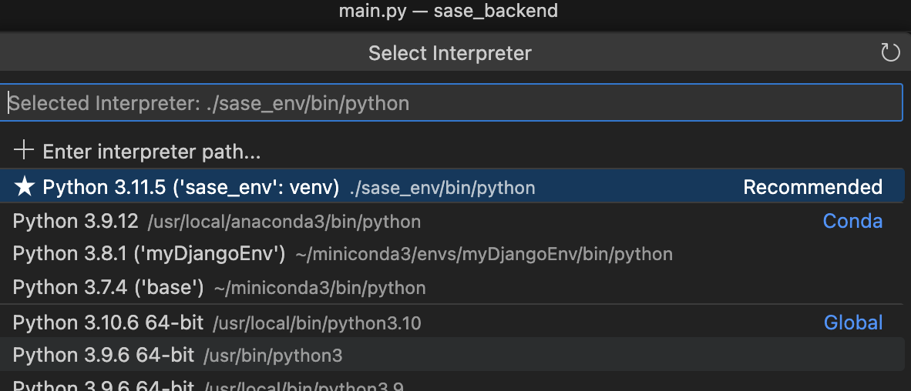

## Setup

On Mac:

```
python3 -m venv sase_env
source sase_env/bin/activate
pip3 install -r requirements.txt

uvicorn main:app --reload
http://127.0.0.1:8000/docs
```


## Github Management Reminder
```
git pull
git add --all
git commit -m "I made some changes"
git push origin HEAD
```

To remove all errors make sure you configure the venv on visual code

